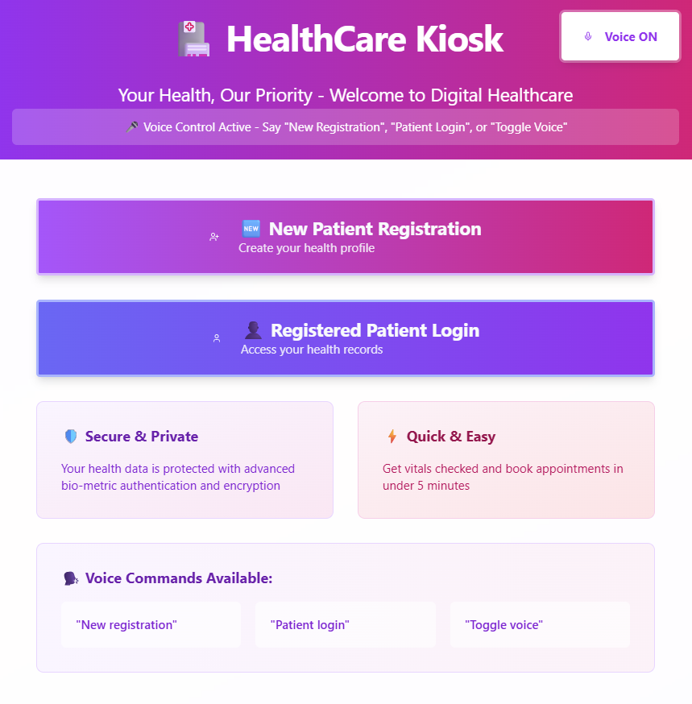

# 🏥 Brainy Bunch Intel Unnati Healthcare Kiosk

A real-time, privacy-focused Healthcare Kiosk system powered by Federated Learning, AI-driven patient vitals prediction, and a responsive voice-enabled UI.  
Developed as part of Intel Unnati Initiative.

---

## 📦 Project Structure

```

the-brainy-bunch-intel-unnati-healthcare-kiosk/
├── modules/
│   ├── face-detection/       # Face Recognition module
│   ├── federated-learning/   # Federated Learning + Streamlit Dashboard
│   └── ui/                   # Lovable.dev powered Frontend UI
├── images/                   # UI screenshots and demo images
├── Healthcare-Kiosk-Documentation.pdf
├── Healthcare-Kiosk-Demo-Video.mp4
└── README.md

```

---

## 🎯 Key Features

- **Voice-enabled UI** built with React, Vite, TailwindCSS
- **Face Detection Module** for kiosk login
- **Federated Learning System** (Flower + Streamlit + Supabase)
- **PDF report generation** for patient vitals and predictions
- **Live Federated Learning metrics dashboard**
- **Supabase database integration**
- **Dynamic medication prediction model trained on synthetic vitals**

---

## 📸 Project Preview

### 🎨 UI Homepage  


### 🎙️ UI Voice Toggle Enabled  


<!-- 🚀 Federated Learning Dashboard screenshot will be added soon -->

---

## 📄 Documentation

👉 [Healthcare Kiosk Documentation (PDF)](Healthcare-Kiosk-Documentation.pdf)

---

## 📺 Demo Video

👉 [Healthcare Kiosk Demo Video (MP4)](Healthcare-Kiosk-Demo-Video.mp4)

---

## 🔧 Tech Stack

- **Frontend:** React, Vite, Tailwind CSS, shadcn-ui
- **Backend:** Python, Streamlit, Flower (Federated Learning)
- **Database:** Supabase (PostgreSQL)
- **Machine Learning:** Scikit-learn
- **PDF Generation:** fpdf
- **Version Control:** Git, GitHub

---

## 📈 Future Enhancements

- Model versioning and deployment
- Real patient data integration
- Kiosk-wise model drift detection
- Live WebSocket-based dashboard updates
- Integrated Supabase Authentication

---

## 👥 Team

**Team Name:** The Brainy Bunch  
**Intel Unnati Innovation Challenge 2025**

- Macharouthu Sathya Abhiram Verma
- Mrigank Shekhar
- Chinmayee Chintapati
- Shreya Kondur
- Vemulapalli Shodhan

---

## 📌 Note

- This project was developed as part of an academic-industry collaboration.
- Federated Learning image preview to be added once finalized.

---

## 📣 License

For educational and demo purposes only.

